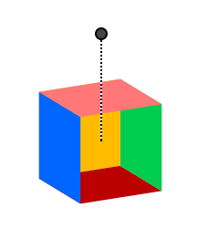

# jQuery Cubelet

## A widget for prototyping CSS rotations

  * [__API documentation__](http://jeremyckahn.github.io/cubelet/dist/doc/src/init.js.html#cubeletInit)

jQuery Cubelet (or just Cubelet) is a jQuery plugin that provides a graphical widget for defining the three axes of rotation for an element.  This is useful for prototyping how an element might look with the CSS `transform` properties `rotateX`, `rotateY`, and `rotateZ` applied.

This widget puts a 3D cube on a web page which can be rotated with the mouse.  Clicking and dragging the cube will modify the X and Y axes, and dragging the "rotation arm" that extends from the center of the cube will modify the Z axis.



This widget was created specifically for use in [Stylie](http://jeremyckahn.github.io/stylie/), but may have uses elsewhere.  Admittedly it is not terribly flexible in its current state, as I didn't really know what other use cases it might have.  If there are changes you need to make Cubelet more compatible with your project, please [make a feature request](https://github.com/jeremyckahn/cubelet/issues) or submit a Pull Request.

## Compatibility

Cubelet has been tested in the following browsers:

  * Chrome 29
  * Firefox 22
  * Safari 6 (works but has some clipping issues with overlayed elements)

Cubelet is a jQuery plugin and was developed with jQuery 2.0.2.  Newer versions of jQuery should work just fine, but older versions have not been tested.

## Usage

To use Cubelet:

````html
<!DOCTYPE html>
<html>
<head>
  <style>
    /* Not necessary, but keeps the widget inside the viewport */
    .test-cubelet {
      margin: 300px auto 0;
    }
  </style>
</head>
<body>
  <!-- Container element for the Cubelet -->
  <div class="test-cubelet"></div>
  <!-- Load jQuery and the plugin -->
  <script src="http://ajax.googleapis.com/ajax/libs/jquery/2.0.2/jquery.min.js"></script>
  <script src="http://jeremyckahn.github.io/cubelet/dist/jquery.cubelet.min.js"></script>
  <script>
    // Initialize the widget
    var $cubelet = $('.test-cubelet');
    $cubelet.cubeletInit();
  </script>
</body>
</html>
````

## What's with [all the inline styles](src/template.js)?

While inlining an entire stylesheet inside of JavaScript is usually a major antipattern, it makes sense for Cubelet.  The 3D effects require quite a bit of CSS, not to mention vendor prefixing.  Much of the inlined CSS is needed for basic functionality of the widget, not skinning, therefore should probably not be modified.  The advantage of inlining CSS like this is that you only need to worry about loading Cubelet as a single file.

## Credit

The original 3D cube is adapted from work by [David DeSandro](http://desandro.github.com/3dtransforms).
